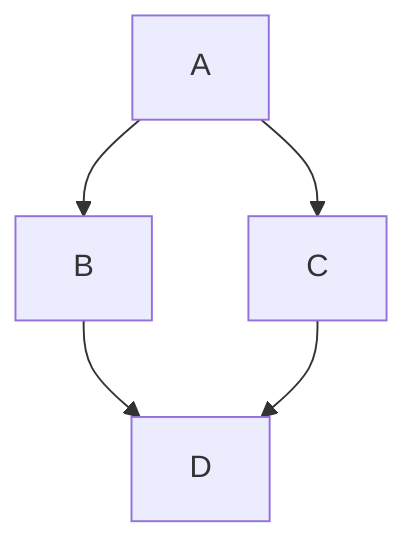
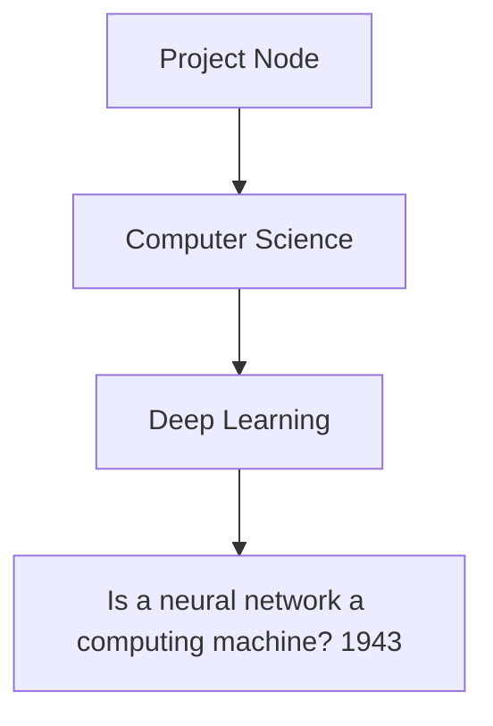

# Deep Learning

This section focuses on deep learning.

We will follow Professor Bau Lab’s paper list as a starting point:

https://papers.baulab.info/

```mermaid
graph TD;
    A-->B;
    A-->C;
    B-->D;
    C-->D;
```

```mermaid
flowchart TD
  root["Project Node"]
  area["Computer Science"]
  subarea["Deep Learning"]

  paper1["Is a neural network a computing machine? 1943"]

  root --> area
  area --> subarea
  subarea --> paper1

  click subarea "/docs/deep-learning" "Go to deep learning docs"
  click paper1 "/docs/deep-learning/mcculloch-pitts" "Go to paper"
```